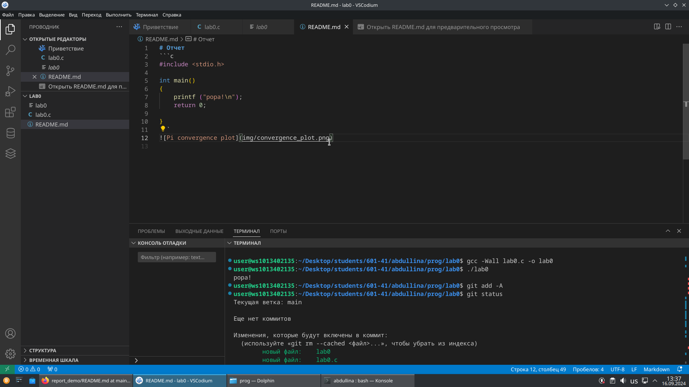
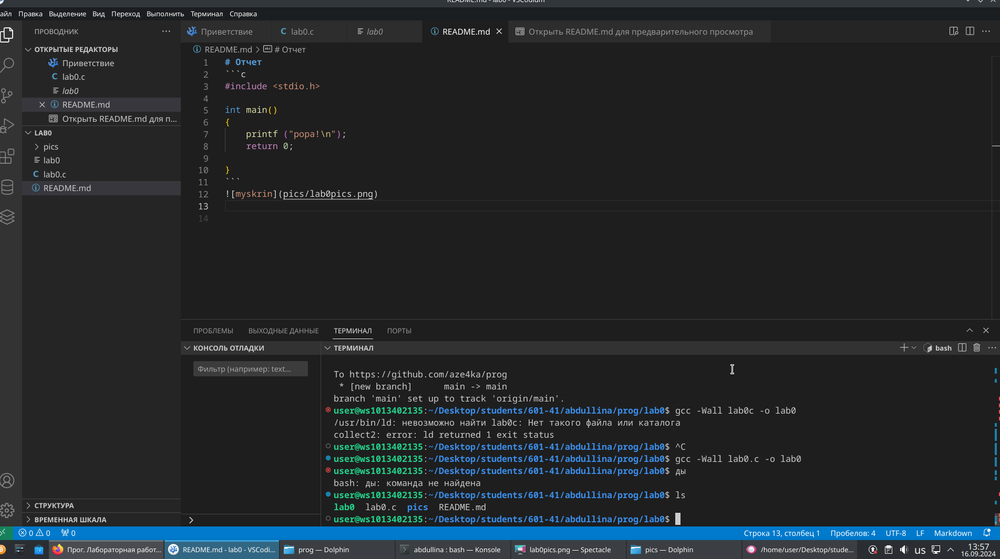
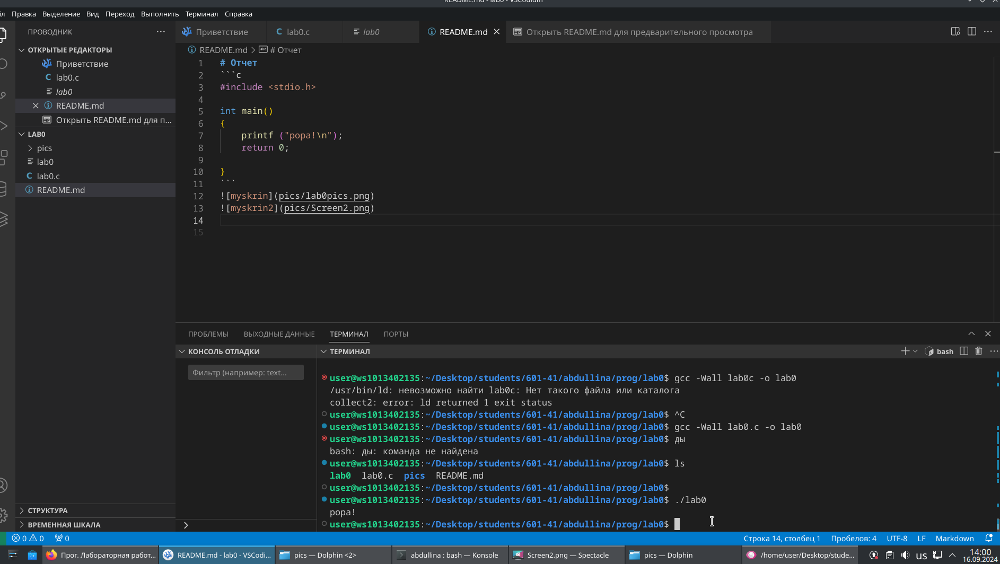
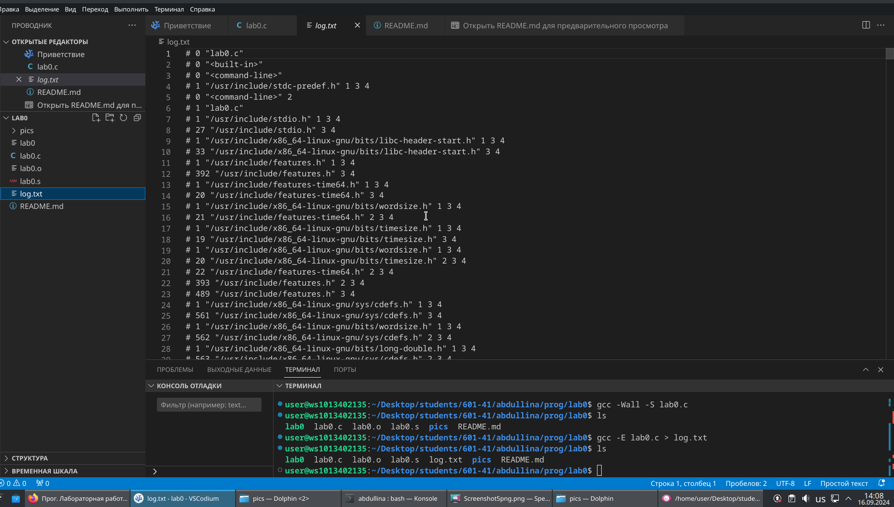

# Отчет
```c
#include <stdio.h>

int main()
{
    printf ("popa!\n");
    return 0;

}
```


//добавляем файл в гид

//скомпилируем лабораторную работу и проверяем файл в гиде

//запускаем скомпилированный файл и добавляем скриншоты работы

//скомпилируем файл и проверим его в текущей директории


//история выполнения компиляции


