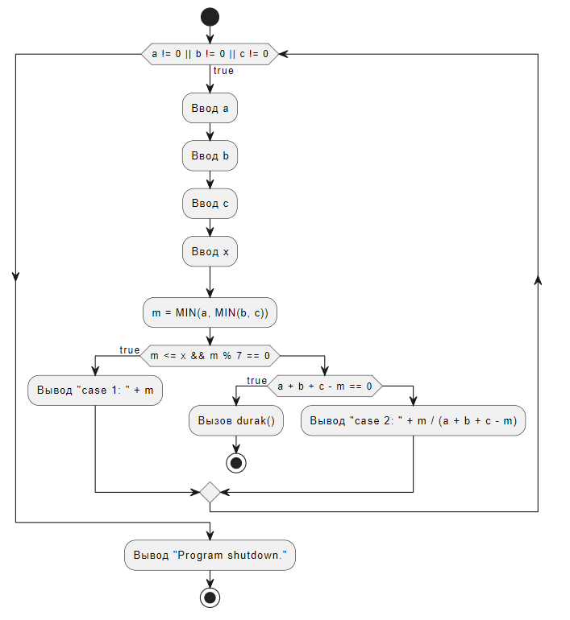

# ОТЧЁТ

## Вывести значение наименьшего из трёх параметров a, b, c если оно меньше или равно x и кратно 7, и частное наименьшего параметра и суммы двух оставшихся иначе.
```C
#include <stdio.h>
#include <stdlib.h>

#define MIN(A, B) (A < B ? A : B)
void durak() {
    printf("The fool protection has worked\n");
    exit(1);
}

void w(int r) {
    if(r <= 0) durak();
}

int main() {
    int a, b, c, x;

    while (1) {
        printf("Enter a (0 to exit): ");
        w(scanf("%i", &a));
        printf("Enter b (0 to exit): ");
        w(scanf("%i", &b));
        printf("Enter c (0 to exit): ");
        w(scanf("%i", &c));
        printf("Enter x: ");
        w(scanf("%i", &x));

        // Проверка на выход
        if (a == 0 && b == 0 && c == 0) {
            printf("Program shutdown.\n");
            break;
        }

        int m = MIN(a, MIN(b, c));

        if (m <= x && m % 7 == 0) {
            printf("case 1: %i\n", m);
        } else {
            if (a + b + c - m == 0) durak();
            printf("case 2: %f\n", (float)m / (a + b + c - m));
        }
    }

    return 0;
}

```

