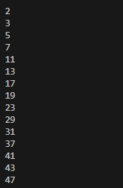

# Отчет по лабораторной работе 10
```python
import typer
from typing_extensions import Annotated
from my_package import lab7, lab8, lab9

app = typer.Typer()

@app.command()
def unpack(data: str):
    """
    Распаковывает вложенные структуры данных (списки, кортежи, множества, словари)
    Пример: python .\lab10\main.py unpack "[None, [1, ({2, 3}, {'foo': 'bar'})]]"
    """
    import ast
    try:
        data_struct = ast.literal_eval(data)
        result = lab7.unpack_recursive(data_struct)
        print(f"Результат распаковки: {result}")
    except Exception as e:
        print(f"Ошибка при обработке данных: {e}")

@app.command()
def read_lines(
    file_path: str,
    log_calls: Annotated[bool, typer.Option("--log", help="Логировать вызовы.")] = False,
    lines_to_read: Annotated[int, typer.Option("--lines", help="Сколько строк читать.", min=1)] = 1
    
):
    """
    Читает строки из файла.
    Пример: python .\lab10\main.py read-lines test.txt --lines 3 --log
    """
    
    if log_calls:
       file_reader = lab8.get_next_line_logged(file_path)
    else:
        file_reader = lab8.line_reader(file_path)

    if file_reader: # Check if file_reader is not a stub
        for _ in range(lines_to_read):
           line = file_reader()
           if line:
               print(line)
           else:
               print("Конец файла.")
               break

@app.command()
def generate_primes(limit: Annotated[int, typer.Option("--limit", help="Верхний предел для генерации простых чисел.")] = 100):
    """
    Генерирует простые числа до заданного предела.
    Пример: python .\lab10\main.py generate-primes --limit 50
    """
    generator = lab9.prime_generator()
    for prime in generator:
        if prime > limit:
            break
        print(prime)


if __name__ == "__main__":
    app()
```


