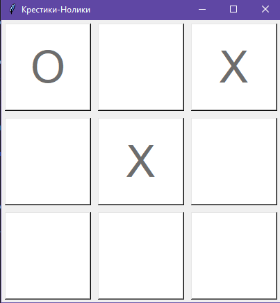

# Лабораторная работа №11
# Крестики-Нолики (Tic-Tac-Toe)
## Описание: Это простая реализация классической игры "Крестики-Нолики" , созданная с использованием библиотеки Tkinter. Игра позволяет двум игрокам по очереди ставить "X" и "O" на поле 3x3. Цель игры - первым собрать три своих символа в ряд (по горизонтали, вертикали или диагонали).

## Инструкции по запуску

1.  **Убедитесь, что у вас установлен Python:**

2.  **Клонируйте или скачайте репозиторий:**
3.  **Запустите скрипт:**
4.  **Играйте!**

## Краткая справка

*   **Игровое поле:** Представляет собой сетку 3x3, где каждый игрок может поставить свой символ.
*   **Ходы:** Игроки ходят по очереди, начиная с игрока "X".
*   **Цель игры:** Первым собрать три своих символа в ряд по горизонтали, вертикали или диагонали.
*   **Победа:** Как только один из игроков достигнет цели, на экране появится сообщение о победе, и игра перезапустится.
*   **Ничья:** Если все клетки заполнены, но ни один из игроков не победил, игра объявляется ничьей и перезапускается.
*   **Перезапуск:** После победы или ничьей игра автоматически перезапускается, поле очищается.
``` py
import tkinter as tk
from tkinter import messagebox

class TicTacToe:
    def __init__(self, root):
        self.root = root
        self.root.title("Крестики-Нолики")

        self.current_player = "X"
        self.board = [""] * 9
        self.buttons = []

        self.create_board()

    def create_board(self):
        for i in range(9):
            button = tk.Button(
                self.root,
                text="",
                font=("Helvetica", 48),
                width=3,
                height=1,
                command=lambda idx=i: self.make_move(idx),
                bg="white"  # Установка белого фона для кнопок
            )
            row = i // 3
            col = i % 3
            button.grid(row=row, column=col, padx=5, pady=5)
            self.buttons.append(button)

    def make_move(self, idx):
        if self.board[idx] == "":
            self.board[idx] = self.current_player
            self.buttons[idx].config(text=self.current_player, state="disabled")

            if self.check_winner():
                messagebox.showinfo("Игра окончена", f"Победил игрок: {self.current_player}!")
                self.reset_game()
            elif all(cell != "" for cell in self.board):
                messagebox.showinfo("Игра окончена", "Ничья!")
                self.reset_game()
            else:
                self.current_player = "O" if self.current_player == "X" else "X"

    def check_winner(self):
        winning_combinations = [
            (0, 1, 2), (3, 4, 5), (6, 7, 8),  # Горизонтали
            (0, 3, 6), (1, 4, 7), (2, 5, 8),  # Вертикали
            (0, 4, 8), (2, 4, 6)             # Диагонали
        ]
        for a, b, c in winning_combinations:
            if self.board[a] == self.board[b] == self.board[c] != "":
                return True
        return False

    def reset_game(self):
        self.current_player = "X"
        self.board = [""] * 9
        for button in self.buttons:
            button.config(text="", state="normal", bg="white")  # Сбрасываем фон и включаем кнопки

if __name__ == "__main__":
    root = tk.Tk()
    game = TicTacToe(root)
    root.mainloop()
```





# После победы одного из игроков игра запускается заново.