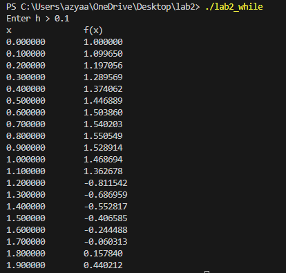
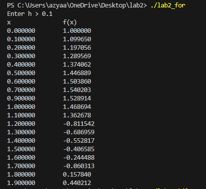
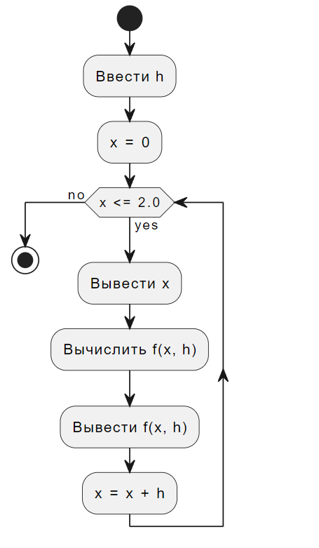

# ОТЧЁТ
## Напишите программу по варианту, используя оператор цикла while (нечётные варианты).
## Напишите программу, используя оператор цикла for.
## Постройте график с использованием gnuplot.
## Составьте блок-схемы.
## Вариант 3.
## 1. Программа с оператором цикла while:
```c
#include <stdio.h>
#include <math.h>

float f(float x, float h) {
    const float eps = h / 2;
    if (x > 0.0f - eps && x <= 1.1f + eps)
        return cos(x) * exp(sqrt(pow(-x, 2)));
    else if (x >= 1 - eps && x <= 2 + eps)
        return log(x + 1) - sqrt(4 - pow(x, 2));
    return 0.0f;
}

int main() {
    float h, x = 0;
    printf("Enter h > ");
    scanf("%f", &h);
    printf("x\t\tf(x)\n");
    while (x <= 2.0f) {
        printf("%f\t%f\n", x, f(x, h));
        x += h;
    }
    return 0;
}
```

## 2. Программа с оператором цикла for
```c
#include <stdio.h>
#include <math.h>

float f(float x, float h) {
    const float eps = h / 2;
    if (x > 0.0f - eps && x <= 1.1f + eps)
        return cos(x) * exp(sqrt(pow(-x, 2)));
    else if (x >= 1 - eps && x <= 2 + eps)
        return log(x + 1) - sqrt(4 - pow(x, 2));
    return 0.0f;
}

int main() {
    float h;
    printf("Enter h > ");
    scanf("%f", &h);
    printf("x\t\tf(x)\n");
    
    for (float x = 0; x <= 2.0f; x += h) {
        printf("%f\t%f\n", x, f(x, h));
    }
    
    return 0;
}
```

## Составленная блок-схема:


