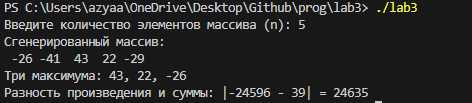

# ОТЧЁТ
## Найти три максимума в массиве и записать разность их произведения и суммы по индексу суммы их индексов по модулю n, где n - количество элементов массива.
```c
// Подключаем библиотеки
#include <stdio.h>
#include <stdlib.h>
#include <time.h>
// Функция заполнения массива
void fill(int n, int a[]) {
    for (int i = 0; i < n; i++)
        a[i] = rand() % 101 - 50; // Заполнение массива случайными числами от -50 до 50
}
// Функция поиска трех максимальных значений
void findThreeMax(int n, int a[], int *max1, int *max2, int *max3) {
    *max1 = *max2 = *max3 = -51; // Инициализация минимальным значением

    for (int i = 0; i < n; i++) {
        if (a[i] > *max1) {
            *max3 = *max2;
            *max2 = *max1;
            *max1 = a[i];
        } else if (a[i] > *max2) {
            *max3 = *max2;
            *max2 = a[i];
        } else if (a[i] > *max3) {
            *max3 = a[i];
        }
    }
}

// Основная функция
int main() {
    srand(time(NULL));
    int n;
    printf("Введите количество элементов массива (n): ");
    scanf("%d", &n);
    
    if (n < 3) {
        printf("Количество элементов должно быть не менее 3.\n");
        return 1;
    }

    int A[n];
    fill(n, A);

    printf("Сгенерированный массив:\n");
    for (int i = 0; i < n; i++)
        printf("%4d", A[i]);
    printf("\n");

    int max1, max2, max3;
    findThreeMax(n, A, &max1, &max2, &max3);

    // Вычисление произведения и суммы
    int product = max1 * max2 * max3;
    int sum = max1 + max2 + max3;

    // Индекс суммы индексов
    int indexSum = (0 + 1 + 2) % n; // Индексы первых трех максимальных элементов
    int result = abs(product - sum);

    printf("Три максимума: %d, %d, %d\n", max1, max2, max3);
    printf("Разность произведения и суммы: |%d - %d| = %d\n", product, sum, result);

    return 0;
}
```
## Результат работы программы:
