# ОТЧЁТ
## 0.
``` py
#!/usr/bin/env python3
# -*- coding: utf-8 -*-

# Есть словарь координат городов
sites = {
    'Moscow': (550, 370),
    'London': (510, 510),
    'Paris': (480, 480),
}

# Составим словарь словарей расстояний между ними
# расстояние на координатной сетке - ((x1 - x2) ** 2 + (y1 - y2) ** 2) ** 0.5

distances = {}

def dist(i, j):
    x1, y1 = sites[i]
    x2, y2 = sites[j]
    return ((x1 - x2) ** 2 + (y1 - y2) ** 2) ** 0.5

names = sites.keys()
for i in names:
    distances[i] = {j: dist(i, j) for j in names}

print(distances)

```
## Ответ:
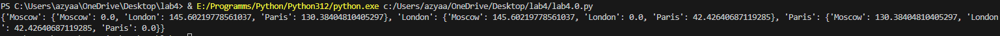
## 1.
```py
#!/usr/bin/env python3
# -*- coding: utf-8 -*-

# Есть значение радиуса круга
radius = 42

# Выведите на консоль значение площади этого круга с точностью до 4-х знаков после запятой
# Формула площади круга: S = π * r^2
pi = 3.1415926
area = round(pi * radius ** 2, 4)
print(area)

# Далее, пусть есть координаты точки
point_1 = (23, 34)  # где 23 - координата x, 34 - координата y

# Функция для проверки, находится ли точка внутри круга
def is_point_inside_circle(point):
    # Определяем расстояние от точки до начала координат (0, 0)
    distance = (point[0] ** 2 + point[1] ** 2) ** 0.5
    # Возвращаем True, если расстояние меньше или равно радиусу, иначе False
    return distance <= radius

# Проверяем первую точку
print(is_point_inside_circle(point_1))

# Аналогично для другой точки
point_2 = (30, 30)

# Проверяем вторую точку
print(is_point_inside_circle(point_2))
```
## Ответ:
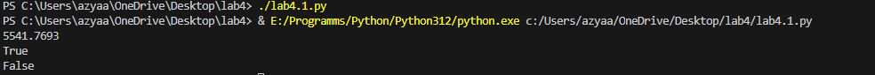
## 2.
```py
#!/usr/bin/env python3
# -*- coding: utf-8 -*-

# Расставьте знаки операций "плюс", "минус", "умножение" и скобки
# между числами "1 2 3 4 5" так, что бы получилось число "25".
#
# Использовать нужно только указанные знаки операций, но не обязательно все перечесленные.
# Порядок чисел нужно сохранить.

# Пример для чисел "1 2 3" и "9"
# result = (1 + 2) * 3
# print(result)

# Формула для чисел 1, 2, 3, 4, 5, чтобы получить 25
result = (1 + 2) * (3 + 4) + 5
print(result)
```
## Ответ:
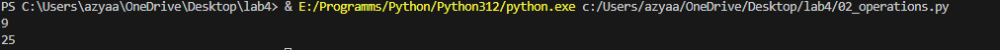
## 3.
```py
#!/usr/bin/env python3
# -*- coding: utf-8 -*-

# Есть строка с перечислением фильмов
my_favorite_movies = 'Терминатор, Пятый элемент, Аватар, Чужие, Назад в будущее'

# Выведите на консоль с помощью индексации строки, последовательно:
#   первый фильм
#   последний
#   второй
#   второй с конца

# Запятая не должна выводиться.  Переопределять my_favorite_movies нельзя
# Использовать .split() или .find()или другие методы строки нельзя - пользуйтесь только срезами,
# как указано в задании!

# Индексы для фильмов
first_movie = my_favorite_movies[:10]  # "Терминатор"
last_movie = my_favorite_movies[-15:]    # "Назад в будущее"
second_movie = my_favorite_movies[12:25]  # "Пятый элемент"
second_last_movie = my_favorite_movies[-22:-17]  # "Чужие"

# Выводим результаты
print(first_movie)
print(last_movie)
print(second_movie)
print(second_last_movie)
```
## Ответ:
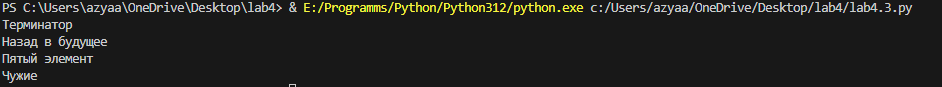
## 4.
```py
#!/usr/bin/env python3
# -*- coding: utf-8 -*-

# Создайте списки:

# моя семья 
my_family = ['папа', 'мама', 'я', 'дедушка', 'бабушка']

# список списков приблизительного роста членов вашей семьи
my_family_height = [
    ['папа', 180],
    ['мама', 160],
    ['я', 157],
    ['дедушка', 175],
    ['бабушка', 160]
]

# Выведите на консоль рост отца в формате
#   Рост отца - ХХ см
father_height = next((height for name, height in my_family_height if name == 'папа'), None)
if father_height is not None:
    print('Рост отца -', father_height, 'см')

# Выведите на консоль общий рост вашей семьи как сумму ростов всех членов
#   Общий рост моей семьи - ХХ см
total_height = sum(height for name, height in my_family_height)
print('Общий рост моей семьи -', total_height, 'см')
```
## Ответ
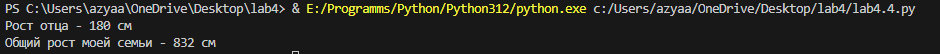

## 5.
```py
#!/usr/bin/env python3
# -*- coding: utf-8 -*-

# есть список животных в зоопарке
zoo = ['lion', 'kangaroo', 'elephant', 'monkey']

# посадите медведя (bear) между львом и кенгуру
zoo.insert(1, "bear")
print("Список животных после посадки медведя:", zoo)

# добавьте птиц из списка birds в последние клетки зоопарка
birds = ['rooster', 'ostrich', 'lark']
for bird in birds:
    zoo.append(bird)
print("Список животных после добавления птиц:", zoo)

# уберите слона
zoo.remove("elephant")
print("Список животных после удаления слона:", zoo)

# выведите на консоль в какой клетке сидит лев (lion) и жаворонок (lark).
# Номера при выводе должны быть понятны простому человеку, не программисту.
lion_index = zoo.index("lion") + 1  # +1 для удобства пользователя
lark_index = zoo.index("lark") + 1   # +1 для удобства пользователя
print(f"Лев сидит в клетке номер {lion_index}, жаворонок сидит в клетке номер {lark_index}.")
```
## Ответ:
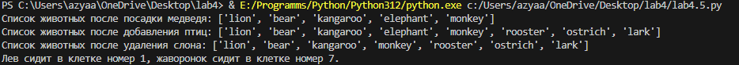
## 6.
```py
#!/usr/bin/env python3
# -*- coding: utf-8 -*-
# Есть список песен группы Depeche Mode со временем звучания с точностью до долей минут
# Точность указывается в функции round(a, b)
# где a, это число которое надо округлить, а b количество знаков после запятой
# более подробно про функцию round смотрите в документации https://docs.python.org/3/search.html?q=round

violator_songs_list = [
    ['World in My Eyes', 4.86],
    ['Sweetest Perfection', 4.43],
    ['Personal Jesus', 4.56],
    ['Halo', 4.9],
    ['Waiting for the Night', 6.07],
    ['Enjoy the Silence', 4.20],
    ['Policy of Truth', 4.76],
    ['Blue Dress', 4.29],
    ['Clean', 5.83],
]

# Распечатайте общее время звучания трех песен: 'Halo', 'Enjoy the Silence' и 'Clean'
songs_to_sum_list = ['Halo', 'Enjoy the Silence', 'Clean']
total_time_list = round(sum(song[1] for song in violator_songs_list if song[0] in songs_to_sum_list), 2)
print('Три песни звучат', total_time_list, 'минут')

# Есть словарь песен группы Depeche Mode
violator_songs_dict = {
    'World in My Eyes': 4.76,
    'Sweetest Perfection': 4.43,
    'Personal Jesus': 4.56,
    'Halo': 4.30,
    'Waiting for the Night': 6.07,
    'Enjoy the Silence': 4.6,
    'Policy of Truth': 4.88,
    'Blue Dress': 4.18,
    'Clean': 5.68,
}

# Распечатайте общее время звучания трех песен: 'Sweetest Perfection', 'Policy of Truth' и 'Blue Dress'
songs_to_sum_dict = ['Sweetest Perfection', 'Policy of Truth', 'Blue Dress']
total_time_dict = round(sum(violator_songs_dict[song] for song in songs_to_sum_dict), 2)
print('А другие три песни звучат', total_time_dict, 'минут')
```
## Ответ:
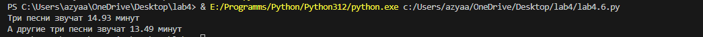
## 7.
```py
#!/usr/bin/env python3
# -*- coding: utf-8 -*-

# Есть зашифрованное сообщение

secret_message = [
    'квевтфпп6щ3стмзалтнмаршгб5длгуча',
    'дьсеы6лц2бане4т64ь4б3ущея6втщл6б',
    'т3пплвце1н3и2кд4лы12чф1ап3бкычаь',
    'ьд5фму3ежородт9г686буиимыкучшсал',
    'бсц59мегщ2лятьаьгенедыв9фк9ехб1а',
]

# Расшифровка сообщения
first_word = secret_message[0][3]  # 4-я буква
second_word = secret_message[1][9:13]  # буквы с 10 по 13
third_word = secret_message[2][5:15:2]  # буквы с 6 по 15, через одну
fourth_word = secret_message[3][12:6:-1]  # буквы с 8 по 13 в обратном порядке
fifth_word = secret_message[4][20:15:-1]  # буквы с 17 по 21 в обратном порядке

# Формируем расшифрованное сообщение
decoded_message = f"{first_word} {second_word} {third_word} {fourth_word} {fifth_word}"

# Выводим результат
print(decoded_message)
```
## Ответ:
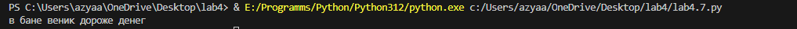
## 8.
```py
#!/usr/bin/env python3
# -*- coding: utf-8 -*-

# В саду сорвали цветы
garden = ('ромашка', 'роза', 'одуванчик', 'ромашка', 'гладиолус', 'подсолнух', 'роза')

# На лугу сорвали цветы
meadow = ('клевер', 'одуванчик', 'ромашка', 'клевер', 'мак', 'одуванчик', 'ромашка')

# Создайте множество цветов, произрастающих в саду и на лугу
garden_set = set(garden)
meadow_set = set(meadow)

# Выведите на консоль все виды цветов
print("Все виды цветов:", garden_set.union(meadow_set))

# Выведите на консоль те, которые растут и там, и там
print("Цветы, растущие и там, и там:", garden_set.intersection(meadow_set))

# Выведите на консоль те, которые растут в саду, но не растут на лугу
print("Цветы, растущие в саду, но не растущие на лугу:", garden_set.difference(meadow_set))

# Выведите на консоль те, которые растут на лугу, но не растут в саду
print("Цветы, растущие на лугу, но не растущие в саду:", meadow_set.difference(garden_set))
```
## Ответ:
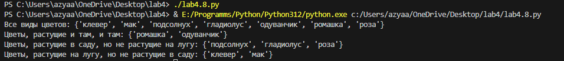
## 9.
```py
#!/usr/bin/env python3
# -*- coding: utf-8 -*-

# Есть словарь магазинов с распродажами
shops = {
    'ашан': [
        {'name': 'печенье', 'price': 10.99},
        {'name': 'конфеты', 'price': 34.99},
        {'name': 'карамель', 'price': 45.99},
        {'name': 'пирожное', 'price': 67.99}
    ],
    'пятерочка': [
        {'name': 'печенье', 'price': 9.99},
        {'name': 'конфеты', 'price': 32.99},
        {'name': 'карамель', 'price': 46.99},
        {'name': 'пирожное', 'price': 59.99}
    ],
    'магнит': [
        {'name': 'печенье', 'price': 11.99},
        {'name': 'конфеты', 'price': 30.99},
        {'name': 'карамель', 'price': 41.99},
        {'name': 'пирожное', 'price': 62.99}
    ],
}

# Создайте словарь цен на продукты
sweets = {}

# Заполняем словарь sweets на основе данных из shops
for shop, products in shops.items():
    for product in products:
        name = product['name']
        price = product['price']
        
        # Если сладость еще не добавлена, создаем новую запись
        if name not in sweets:
            sweets[name] = []
        
        # Добавляем магазин и цену в список
        sweets[name].append({'shop': shop, 'price': price})

# Указываем только по 2 магазина с минимальными ценами
for sweet, stores in sweets.items():
    # Сортируем магазины по цене
    sorted_stores = sorted(stores, key=lambda x: x['price'])
    
    # Оставляем только два магазина с минимальными ценами
    top_stores = sorted_stores[:2]
    
    print(f"{sweet}:")
    for store in top_stores:
        print(f" - {store['shop']}: {store['price']:.2f}")
```
## Ответ:
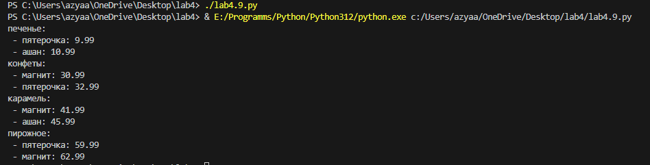
## 10.
```py
#!/usr/bin/env python3
# -*- coding: utf-8 -*-

# Есть словарь кодов товаров
goods = {
    'Лампа': '12345',
    'Стол': '23456',
    'Диван': '34567',
    'Стул': '45678',
}

# Есть словарь списков количества товаров на складе.
store = {
    '12345': [
        {'quantity': 27, 'price': 42},
    ],
    '23456': [
        {'quantity': 22, 'price': 510},
        {'quantity': 32, 'price': 520},
    ],
    '34567': [
        {'quantity': 2, 'price': 1200},
        {'quantity': 1, 'price': 1150},
    ],
    '45678': [
        {'quantity': 50, 'price': 100},
        {'quantity': 12, 'price': 95},
        {'quantity': 43, 'price': 97},
    ],
}

# Рассчитать на какую сумму лежит каждого товара на складе

# Лампы
lamp_code = goods['Лампа']
lamps_item = store[lamp_code][0]
lamps_quantity = lamps_item['quantity']
lamps_price = lamps_item['price']
lamps_cost = lamps_quantity * lamps_price
print('Лампа -', lamps_quantity, 'шт, стоимость', lamps_cost, 'руб')

# Столы
table_code = goods['Стол']
tables_items = store[table_code]
tables_quantity = sum(item['quantity'] for item in tables_items)
tables_cost = sum(item['quantity'] * item['price'] for item in tables_items)
print('Стол -', tables_quantity, 'шт, стоимость', tables_cost, 'руб')

# Диваны
sofa_code = goods['Диван']
sofas_items = store[sofa_code]
sofas_quantity = sum(item['quantity'] for item in sofas_items)
sofas_cost = sum(item['quantity'] * item['price'] for item in sofas_items)
print('Диван -', sofas_quantity, 'шт, стоимость', sofas_cost, 'руб')

# Стулья
chair_code = goods['Стул']
chairs_items = store[chair_code]
chairs_quantity = sum(item['quantity'] for item in chairs_items)
chairs_cost = sum(item['quantity'] * item['price'] for item in chairs_items)
print('Стул -', chairs_quantity, 'шт, стоимость', chairs_cost, 'руб')
```
## Ответ:
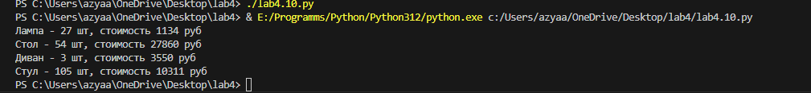