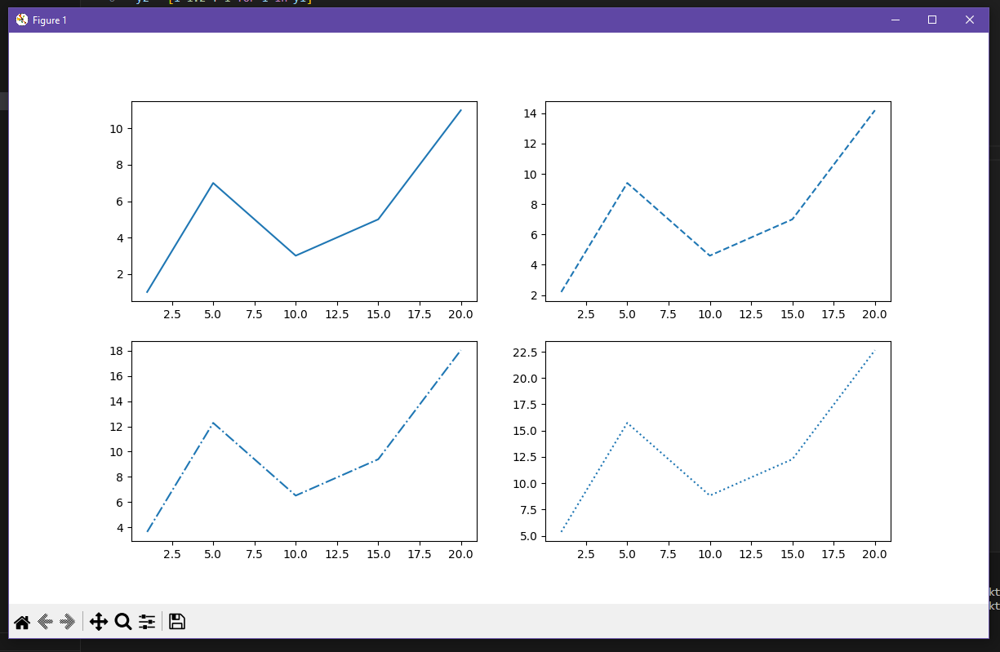

# Лабораторная работа №5
## Задания по книге
## Задание 1
```py
import numpy as np
import matplotlib.pyplot as plt
# Линейная зависимость
x = np.linspace(0, 10, 50)
y1 = x
# Квадратичная зависимость
y2 = [i**2 for i in x]
# Построение графика
plt.title('Зависимости: y1 = x, y2 = x^2') # заголовок
plt.xlabel('x') # ось абсцисс
plt.ylabel('y1, y2') # ось ординат
plt.grid() # включение отображение сетки
plt.plot(x, y1, x, y2) # построение графика
plt.show()
```
## Результат:


## Задание 2
```py
import numpy as np
import matplotlib.pyplot as plt
# Исходный набор данных
x = [1, 5, 10, 15, 20]
y1 = [1, 7, 3, 5, 11]
y2 = [i*1.2 + 1 for i in y1]
y3 = [i*1.2 + 1 for i in y2]
y4 = [i*1.2 + 1 for i in y3]

# Графики
fig, axs = plt.subplots(2, 2, figsize=(12, 7))
axs[0, 0].plot(x, y1, '-')
axs[0, 1].plot(x, y2, '--')
axs[1, 0].plot(x, y3, '-.')
axs[1, 1].plot(x, y4, ':')
plt.show()
```
## Результат:


## Задание 3
```py
import numpy as np
import matplotlib.pyplot as plt

x = [1, 5, 10, 15, 20]
y1 = [1, 7, 3, 5, 11]
y2 = [4, 3, 1, 8, 12]

line1, = plt.plot(x, y1, 'o-b')
line2, = plt.plot(x, y2, 'o-.m')
plt.legend((line2, line1), ['L2', 'L1'])

locs = ['best', 'upper right', 'upper left', 'lower left',
'lower right', 'right', 'center left', 'center right',
'lower center', 'upper center', 'center']
plt.figure(figsize=(12, 12))
for i in range(3):
    for j in range(4):
        if i*4+j < 11:
            plt.subplot(3, 4, i*4+j+1)
            plt.title(locs[i*4+j])
            plt.plot(x, y1, 'o-r', label='line 1')
            plt.plot(x, y2, 'o-.g', label='line 2')
            plt.legend(loc=locs[i*4+j])
        else:
            break

plt.show()
```
## Результат:


## Задание для варианта 3:
```py
import matplotlib.pyplot as plt
import numpy as np
from math import *

#Вариант №3

def f(x):
    return cos(x)*exp(-x**2)

x = np.linspace(-3, 3, 1000)
y1 = [f(i) for i in x]
y2 = [1 for i in x]

plt.title('Лабораторная работа 4, вариант 3')
plt.xlabel('x')
plt.ylabel('y')
plt.grid()
plt.plot(x, y1, label='cos(x)*exp(-x**2)')
plt.plot(x, y2, 'r', label='Касательная')
plt.text(0.785, max(y1)+0.01, 'точка касания')
plt.legend()
plt.show()
```

