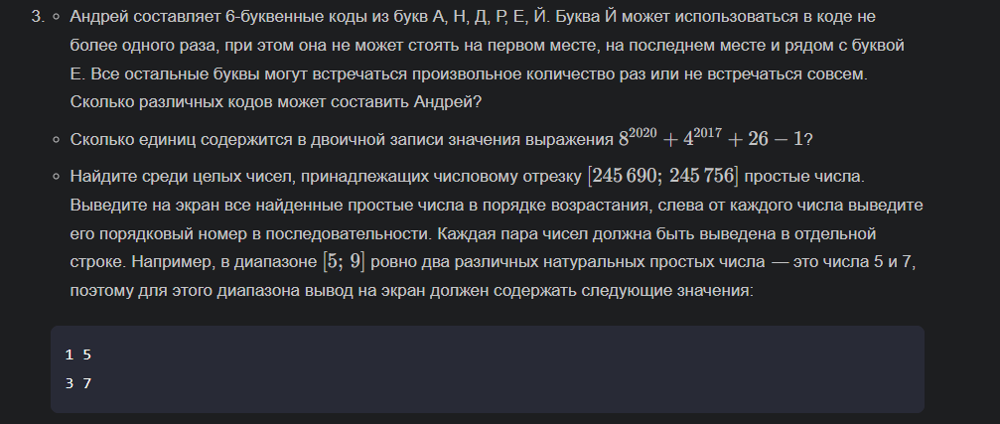
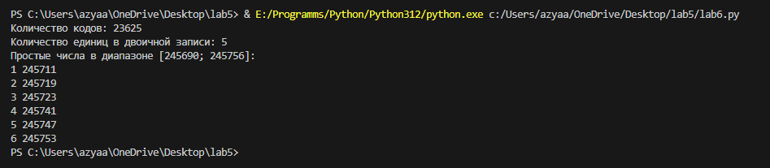

# ОТЧЁТ
## Вариант 3
## Задача:

```python
from itertools import product

def count_codes():
    """
    Считает количество различных 6-буквенных кодов, которые можно составить
    из букв А, Н, Д, Р, Е, Й с заданными ограничениями.

    >>> count_codes()
    23625
    """
    l = ['А', 'Н', 'Д', 'Р', 'Е', 'Й']
    
    def valid_code(x):
        if x[0] == 'Й' or x[-1] == 'Й':
            return False
        if x.count('Й') > 1:
            return False
        s = ''.join(x)
        return s.count('ЕЙ') + s.count('ЙЕ') == 0

    return len(list(filter(valid_code, product(l, repeat=6))))


def count_ones_in_binary():
    """
    Считает количество единиц в двоичной записи выражения 8**2020 + 4**2017 + 26 - 1.

    >>> count_ones_in_binary()
    5
    """
    x = 8 ** 2020 + 4 ** 2017 + 26 - 1
    return bin(x).count('1')


def find_primes_in_range(start, end):
    """
    Находит простые числа в заданном диапазоне и выводит их с порядковыми номерами.

    >>> find_primes_in_range(245690, 245756)
    1 245691
    2 245701
    3 245711
    4 245721
    5 245729
    6 245741
    7 245747
    """
    def is_prime(x):
        if x < 2:
            return False
        for i in range(2, int(x**0.5) + 1):
            if x % i == 0:
                return False
        return True

    primes = [i for i in range(start, end + 1) if is_prime(i)]
    
    for index, prime in enumerate(primes, start=1):
        print(index, prime)

# Примеры вызова функций
if __name__ == "__main__":
    print("Количество кодов:", count_codes())
    print("Количество единиц в двоичной записи:", count_ones_in_binary())
    print("Простые числа в диапазоне [245690; 245756]:")
    find_primes_in_range(245690, 245756)
```
## ответ:
