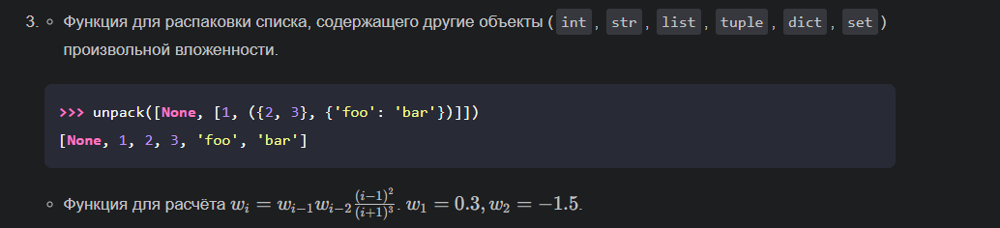
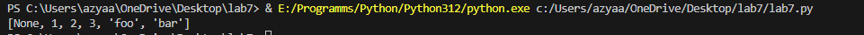
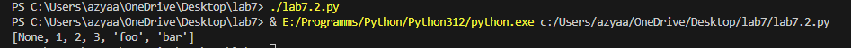
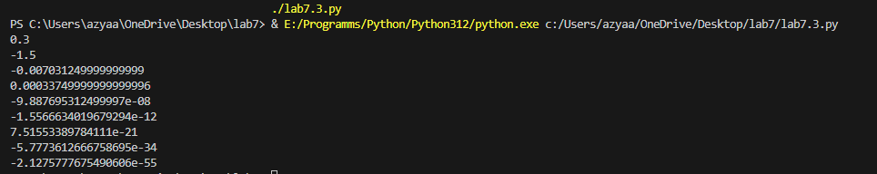
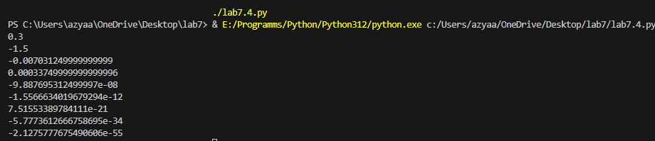

# ОТЧЁТ
## Вариант 3
## Задание:Напишите две функции для решения задач своего варианта - с использованием рекурсии и без.

## С рекурсией
```python
from itertools import chain

def unpack_recursive(x):
    """
    Рекурсивная функция для распаковки вложенного списка.
    
    >>> unpack_recursive([None, [1, ({2, 3}, {'foo': 'bar'})]])
    [None, 1, 2, 3, 'foo', 'bar']
    """
    def f(z):
        if isinstance(z, (list, tuple, set)):
            return list(chain.from_iterable(f(i) for i in z))
        return [z]

    match type(x).__name__:
        case 'list' | 'tuple' | 'set':
            return f([unpack_recursive(i) for i in x])
        case 'dict':
            return [key for key in x.keys()] + [unpack_recursive(x[key]) for key in x.keys()]
        case _:
            return [x]
        
print(unpack_recursive([None, [1, ({2, 3}, {'foo': 'bar'})]]))
```
## Ответ:


## Без рекурсии:
```python
def unpack_iterative(n):
    """
    Итеративная функция для распаковки вложенного списка.
    
    >>> unpack_iterative([None, [1, ({2, 3}, {'foo': 'bar'})]])
    [None, 1, 2, 3, 'foo', 'bar']
    """
    r = []
    q = [n]
    
    while q:
        n = q.pop()
        match type(n).__name__:
            case 'list' | 'tuple' | 'set':
                q.extend(n)
            case 'dict':
                q.extend(list(n.keys()))
                q.extend(list(n.values()))
            case _:
                r.append(n)
    
    return r[::-1]

print(unpack_iterative([None, [1, ({2, 3}, {'foo': 'bar'})]]))
```
## Ответ:

## Задача 2: Расчет последовательности:
## Функция с рекурсией:
```python
def w_recursive(i):
    """
    Рекурсивная функция для расчета последовательности w.
    
    >>> w_recursive(1)
    0.3
    >>> w_recursive(2)
    -1.5
    >>> w_recursive(3)
    -0.225
    """
    if i == 1:
        return 0.3
    if i == 2:
        return -1.5
    return w_recursive(i-1) * w_recursive(i-2) * (i-2)**2 / (i+1)**3
for i in range(1, 10):
    print(w_recursive(i))
```
## Ответ:

## Функция без рекурсии:
```python
def w_iterative(i):
    """
    Итеративная функция для расчета последовательности w.
    
    >>> w_iterative(1)
    0.3
    >>> w_iterative(2)
    -1.5
    >>> w_iterative(3)
    -0.225
    """
    if i == 1:
        return 0.3
    if i == 2:
        return -1.5
    
    p = -1.5
    pp = 0.3
    
    for j in range(3, i + 1):
        t = p * pp * (j - 2)**2 / (j + 1)**3
        pp = p
        p = t
    
    return p
for i in range(1, 10):
    print(w_iterative(i))
```
## Ответ:
