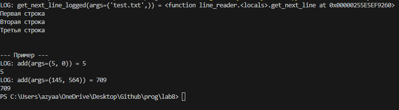
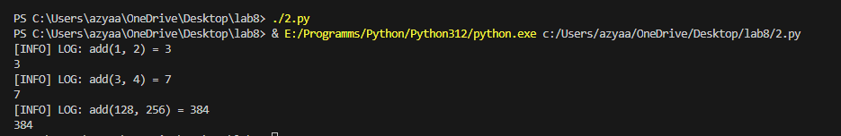

# ОТЧЁТ
## Вариант 3
## Задача 1: Замыкание для получения очередной строки из файла
```python
def line(fname):
    f = open(fname, 'r')
    
    def get_next_line():
        line = f.readline()
        if line == '':  # Если файл закончился
            f.close()  # Закрываем файл
            return None
        return line.strip()  # Убираем лишние пробелы и символы новой строки
    
    return get_next_line

# Пример использования
f = line('1.py')  # Убедитесь, что файл '1.py' существует в директории
print(f())
print(f())
print(f())
```
## ответ:

## Задача 2: Декоратор для логирования вызовов функций
```python
def log(level='INFO'):
    def decorator(f):
        def d(*args, **kwargs):
            r = f(*args, **kwargs)
            print(f'[{level}] LOG: {f.__name__}({", ".join(map(str, args))}) = {r}')
            return r
        return d
    return decorator

@log()  # Используем декоратор без параметров
def add(x, y): 
    return x + y

# Пример использования
print(add(1, 2))
print(add(3, 4))
print(add(128, 256))
```
## ответ:
