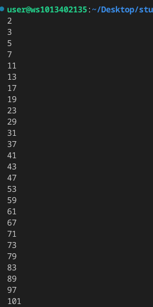

## ОТЧЁТ
# Прог. Лабораторная работа №9
# Генераторы
# Задание:Генератор простых чисел (вариант 3).
``` python
# Функция генерирующая простые числа
def is_prime(n):
    # Проверка, простое ли число
    if n <= 1:
        return False
    for i in range (2, int(n**0.5)+1):
        if n % i == 0:
            return False
    return True

def prime_generator():
    n = 2
    while True:
        if   is_prime (n):
            yield n
        n += 1

for prime in prime_generator():
    print (prime)
    if prime >100:
        break
```
# Вывод в терминале:
